# CSE134B-SS20-HW1
# Name: Julio Rivas
# PID: A18059395

https://juliorivas.netlify.app/

# Part 1

##  Question 2. Chrome DevTools - Network (4 points)

Requests by Content Type
Total # of Requests: 

1 - Document Type

1 - CSS

1 - JS

1 - Font

10 - Images

1 - MP4 

1 - icon

Total: 16

**Total Bytes Sent** (i.e. the amount of data your browse receives and downloads, read this Links to an external site. for details): 6.7 MB sent
Waterfall of Requests Screen Capture:

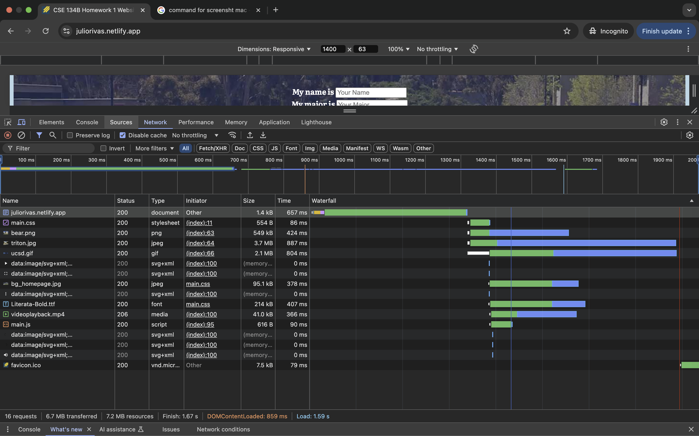

## Question 3. Client-Side Inherently Insecure Demo (1 point)

# Part 2
1. Were any parts of navigating ESPN site easy? Were any parts difficult?
- **The ESPN Sites has way too much going on, the only thing that was easy to look for were game scores that were displayed on the front page. Everything else was difficult to navigate through. I was not able find the top headlines or the top stories.**
2. Were any parts of navigating webaim.org's site easy? Were any parts difficult?
- **The webaim.org site was very easy to navigate through. The site was very clean and easy to read. I was able to find the Accessibility Training quickly.**

# Part 3

## Question 1. HTTP Response Headers + Network Analysis
1. Take a screen capture of the HTTP response headers for UCSD (the root HTML document)
   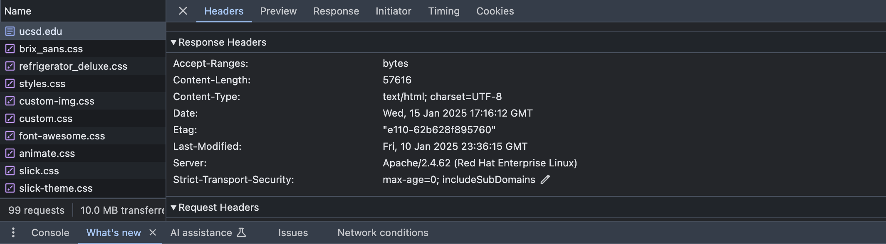
2. Take a screen capture of the HTTP response headers for UCI (the root HTML document)
   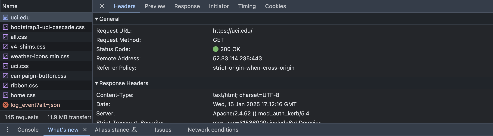
3. What is troubling about the UCI response HTTP headers? **The UCI response HTTP header reveals the type of server UCI uses**
4. With the help of DevTools, for each page, give a rough breakdown of the % of data transferred dedicated to 

**UCI Website**
  - Documents
     - 8/77
   - Stylesheets
     - 9/77
   - Scripts  
     - 17/77
   - Fonts
     - 5/77
   - Images
     - 16/77
**UCSD Website**
   - Documents
     - 5/78
   - Stylesheets
     - 10/78
   - Scripts  
     - 21/78
   - Fonts
     - 5/78
   - Images
     - 32/78

## Question 2. JavaScript Off

Figure out how to disable JavaScript in your Chrome browser. Visit ucsd.edu,scripps.eduLinks to an external site., and ucla.eduLinks to an external site.. Describe the changes to these two home pages in terms of the look and functionality:

1. UCSD visual changes (screen capture)
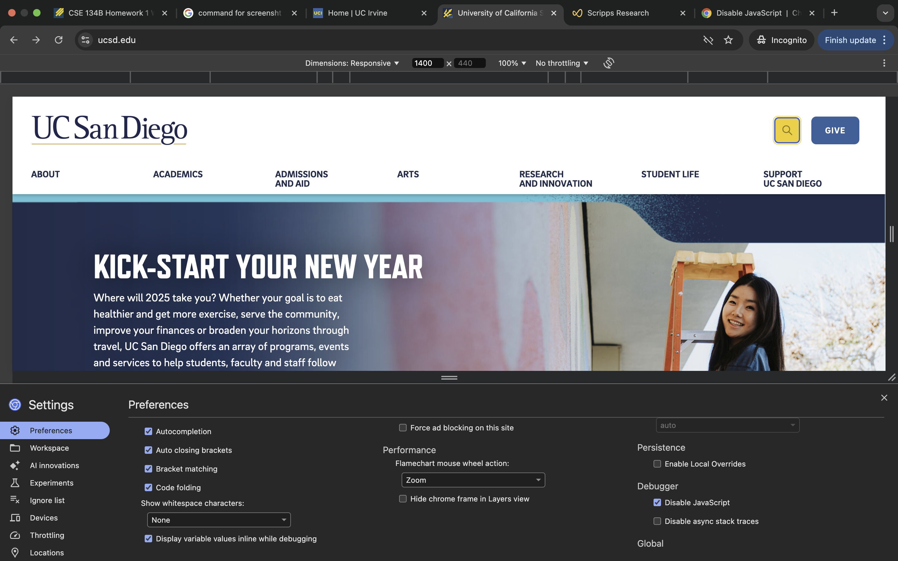
2. UCSD broken features (text description)
- **The search bar doesn't work**
3. Scripps visual changes (screen capture)
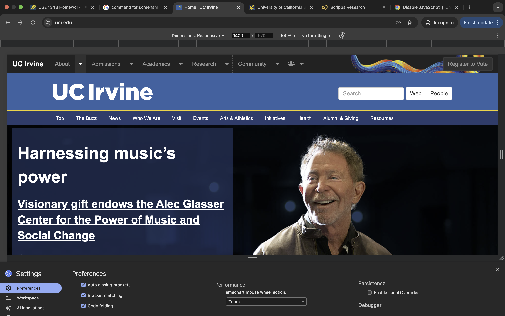
4. Scripps broken features (text description)
- **The menu doesn't work **
5. UCLA visual changes (screen capture)
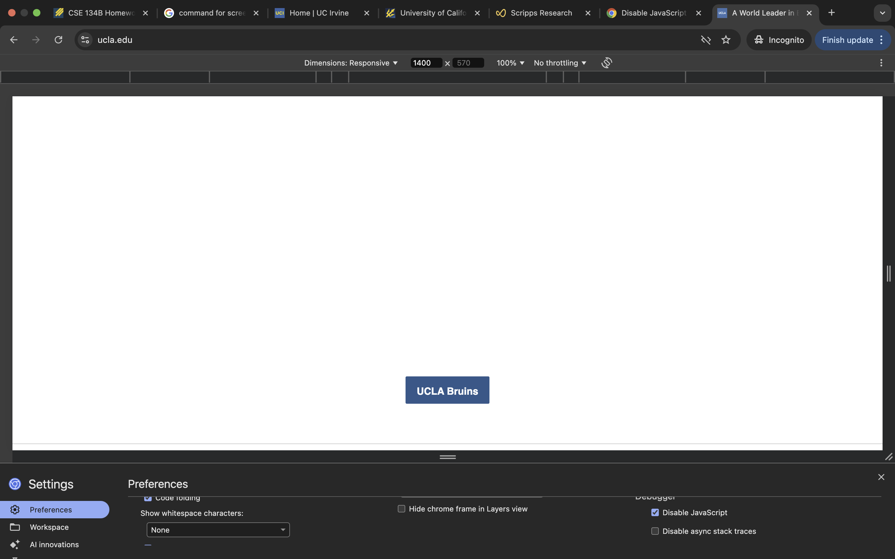
6. UCLA broken features (text description)
- **The twitter posts at the bottom no longer display**
- **Some of the sliding picture modules don't show up**

## Question 3. Custom vs. Default 404 Pages

1. Does csuci.edu Links to an external site. have a custom 404 page? **Yes it does**
2. Write the URL you used to check csuci.edu for a 404 page: **csuci.edu/test**
3. Does jpcatholic.edu Links to an external site. have a custom 404 page?**No it does not**
4. Write the URL you used to check jpcatholic.edu for a 404 page: **jpcatholic.edu/test**
5. Why are custom 404 pages a good idea? In other words, why are default 404 pages a bit of a problem? **because they can help the user navigate the website better and not get lost. Default 404 pages are a problem because they don't help the user navigate the website and can be confusing.**

## Question 4. Search Engines - robots.txt

Find out what a robots.txt file is and what it is used for, then answer these questions

1. Does nytimes.com have a robots.txt file? If it does, provide a screen capture of the file.
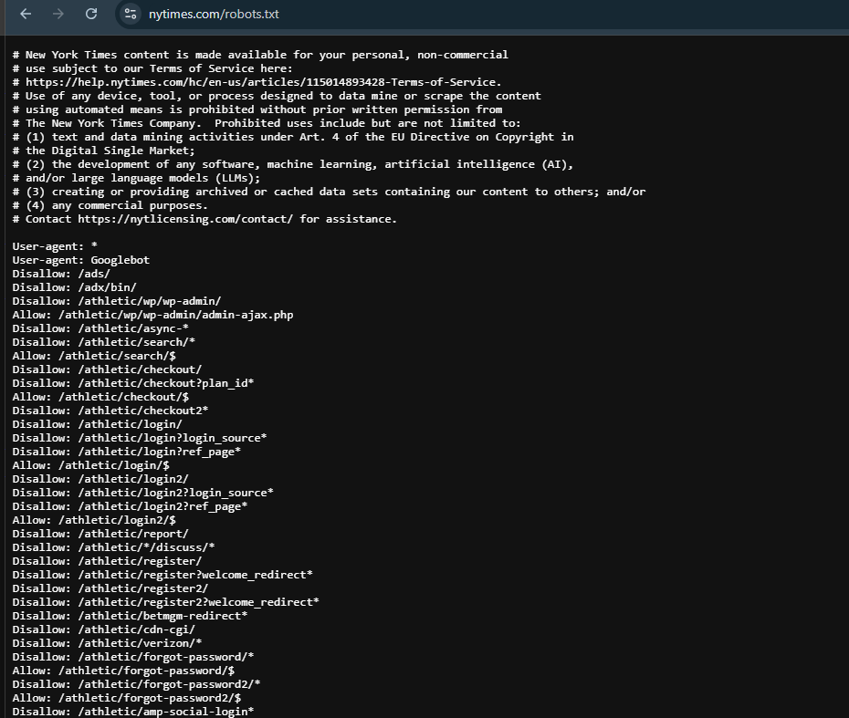
2. What worries do we have about a robots.txt file like the one here? (Hint: Think disclosures) **The robots.txt file can be used to hide information from the public**
3. For the bots as opposed to the * rules do you see the NYT worried about a particular class of crawler?  Explain these newer entries.  You may want to look all of them up and see if they share something in common.
**The New York Times has updated its robots.txt file to specifically disallow access to a range of AI-related web crawlers. This move indicates a strategic effort to prevent the use of its content for training artificial intelligence models without explicit permission.**

## Question 5. Search Engines - Google Hacking

1. Look around the result and explain what “Google Hacking” means? **Google Hacking is using advanced Google search techniques to find sensitive or misconfigured information exposed on websites, such as passwords or admin panels.**
2. What is the Google Bot doing that is troubling and allows for “Google Hacking”? **Google Bot indexes publicly accessible content, including improperly secured sensitive information, which can later be exploited through targeted searches.**
3. As a web developers, what should we be worried about as we do our development when it comes to Google Bot?
Explain how this question (question 5) is related to question:
**Both questions highlight the importance of using tools like robots.txt and proper security practices to control what search engines can access and index**

## Question 6. Search Engines - Results Reality Check 

First, use Google and run the query “Why UCSD is awesome” without quotation marks.

1. Page through the results. Provide the URLs for the 100-110th (approximate is OK) most popular answers to the question “Why UCSD is awesome”.
- https://www.dcurbanmom.com/jforum/posts/list/15/1202407.page
- https://x.com/aedmondstv/status/1869242038837039246?mx=2
- https://www.california.com/the-most-fun-things-to-do-around-uc-san-diego/
- https://www.bleachernation.com/picks/2025/01/19/ucsb-vs-ucsd-womens-college-basketball-odds-and-prediction-january-23/
- https://forum.thegradcafe.com/topic/5389-usc-vs-ucsd-vs-uwseattle-me-eng-master/
- https://www.collegemagazine.com/colleges/university-of-san-diego/
- https://blog.prepscholar.com/list-of-uc-schools-ranking
- https://www.youtube.com/watch?v=QBqzUNdcBSg&ab_channel=UCSantaBarbara
- https://news.ycombinator.com/item?id=579690
- https://ucsdguardian.org/category/opinion/
2. Perform the same query above in both Google AND either Bing, Duckduckgo, Kagi, or a similar search egnine and compare the results for the first page (the first ten results or so).  How similar are the results?  Do you prefer Google or your other choice? Please briefly explain your choice.

**The results are pretty similar both have similar links in the first page, however, I tried Duckduckgo and I prefer it over Google because it doesn't track your searches, it doesn't have ads, and it gave me more search results on the first page.**

## Question 7. Chrome DevTools - JavaScript Console and Local Storage
1. Find the interesting item in your browser’s JavaScript console and screen capture it here.
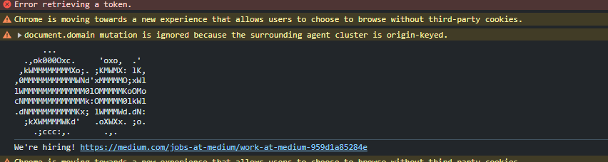
1. Why did Medium put that information there?  (Hint: The professor has even mentioned this in class as a strategy for corporations)
**They put this information to find talent for their tech team. If a user is able to find something like this then maybe they are a good fit for their team.**
1. Navigate to your browser’s Local Storage (under the Application tab of Chrome Dev Tools). Take a screenshot of the local storage table. What do you think these values are set and used for?

- `viewer-statusjs-logged-in`: this track if the user is logged in or not
- **These values are set and used for tracking user data and preferences.**

## Question 8. Chrome DevTools - User-Agent Header

Open and change some settings in your Chrome DevTools to send an iPhone-related user agent header. Visit Google.com with your browser's automatic standard user-agent header and iPhone header.

1. Does Google do something different?
- **Yes Google changes the way the CSS is displayed. The CSS changes to make it work better on an iphone**
2. If so, describe and screen capture it, showing what is happening differently. UPDATE: Include the User-Agent Request Header value from the request to the site in your screenshot as additional evidence the user agent header was changed. This WILL count for points.
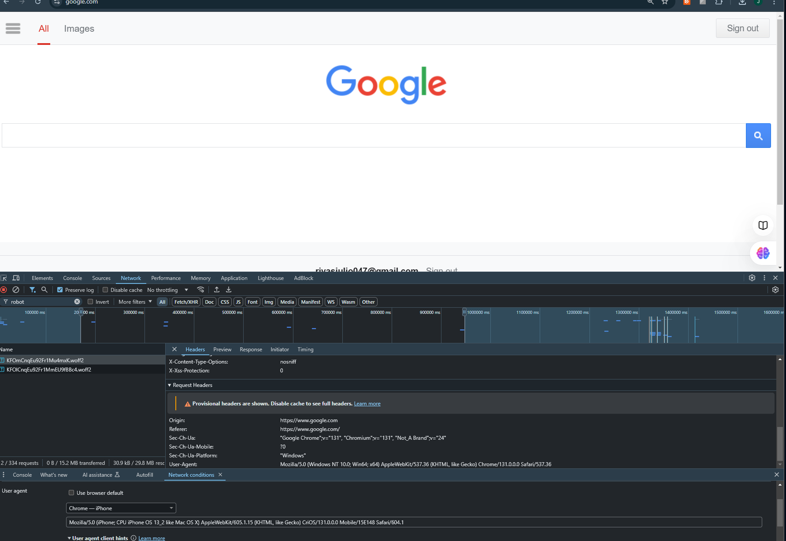

## Question 9. Chrome DevTools - Extension Header 

Using Chrome, visit bootstrapcdn.comLinks to an external site.. In the network monitoring tab, view response and note all the headers that are extension headers (X-) and figure out the purpose of each using Google or reasoning carefully based upon the name and value.

- **X-Powered-By**: `Express`  
  Reveals the backend framework (Express.js). Offers no functional client benefit but can expose tech stack details.  

- **X-Content-Type-Options**: `nosniff`  
  Prevents browsers from MIME type sniffing, ensuring strict adherence to declared `Content-Type`. Protects against MIME confusion and script execution attacks.  

- **X-Frame-Options**: `SAMEORIGIN`  
  Restricts embedding in `<iframe>` to same-origin pages, mitigating clickjacking risks.  

- **X-XSS-Protection**: `1; mode=block`  
  Enables browser's XSS protection to block pages with detected XSS attacks instead of executing malicious scripts.  

- **X-Cache**: `HIT` or `MISS`  
  Indicates whether content was served from the cache (`HIT`) or fetched from the server (`MISS`) to optimize performance.  

- **X-Akamai-Transformed**: (varies)  
  Shows transformations (e.g., compression, optimization) applied by Akamai's CDN before content delivery.  

## Question 10. Chrome DevTools - Performance Test

1. Run a Lighthouse Audit in Chrome DevTools on ucsd.edu and attach a screen capture of the results here.
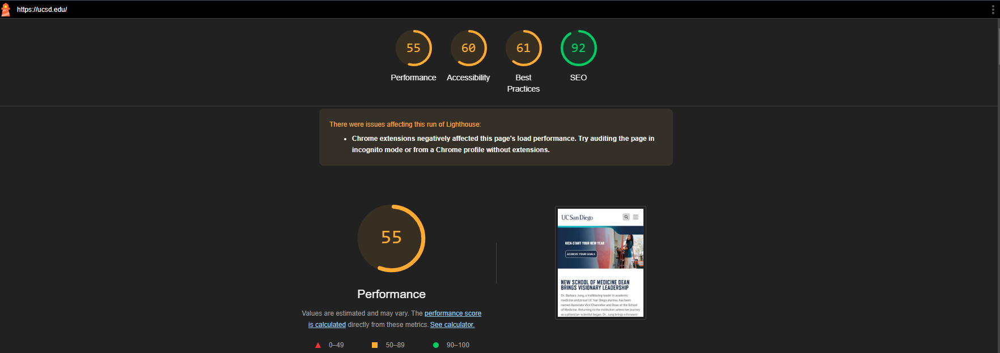
2. What are the top two suggestions for making the page better, according to the audit? Describe what they mean according to the tool and any Google searching you may do about the suggestion.
- **First Contentful Paint**: First Contentful Paint (FCP) tracks the duration until the initial visible content appears on the screen. To improve FCP, focus on accelerating server responses, eliminating or postponing blocking resources such as JavaScript and CSS, and employing effective caching methods to streamline content loading.
- **Largest Contentful Paint**: Largest Contentful Paint (LCP) is a key performance metric used to measure the time it takes for the largest visible element on the screen (such as an image, video, or block of text) to fully render during the page load. It reflects the user's perception of how quickly the main content of the page is displayed.
3. Run a Lighthouse Audit in Chrome Dev Tools on sdsu.eduLinks to an external site.. What scores did they get compared to UCSD? Attach a screen capture. 
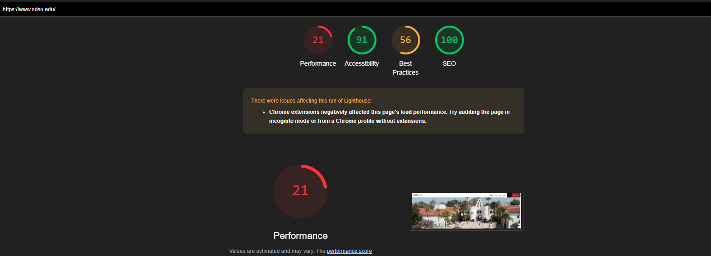
- **SDSU has worse performance scores than UCSD. UCSD has a performance score of 55, while SDSU has a performance score of 21. However, SDSU has a better accessibility score of 91 compared to UCSD's 60**
4. Which school has more performance work to do?
**SDSU needs more performance work.**

## Question 11. Browsers Versions
- **Platform Status Pages:**  
  - Chrome: [https://chromestatus.com/roadmap](https://chromestatus.com/roadmap)  
  - Firefox: [https://platform-status.mozilla.org](https://platform-status.mozilla.org) (shows a "Your connection is not private" error)  
  - Edge: [https://admin.microsoft.com/servicestatus](https://admin.microsoft.com/servicestatus)  
  - Safari: [https://webkit.org/status/](https://webkit.org/status/)  

- **Chrome Version Introducing Shadow DOM v1:**  
  - **Version:** Chrome 53  
  - **Source:** Chrome Platform Status  

- **Release Date of Shadow DOM v1 in Chrome:**  
  - **Date:** August 31, 2016  
  - **Source:** Chrome Release History  

- **Chrome's Age:**  
  - **First Release:** September 2, 2008  
  - **Age (as of January 19, 2025):** 16 years and 4 months

## Question 12. Testing Different or Older Browsers

It might seem like testing older browsers is difficult. For example, Internet Explorer Edge might also be difficult for OSX users. Fortunately, many services are provided to help you here. Try BrowserStack using this URL - [BrowserStackLinks to an external site.]

You will need to set up an account but you should NOT have to set up a paid plan to complete this assignment - please contact the course staff if you are being forced to do so.

1. Using BrowserStack, test Firefox in a very old version (v. 25 or earlier) on http://www.ucsf.eduLinks to an external site. and see if it works. Take a screenshot of the result and provide it here.
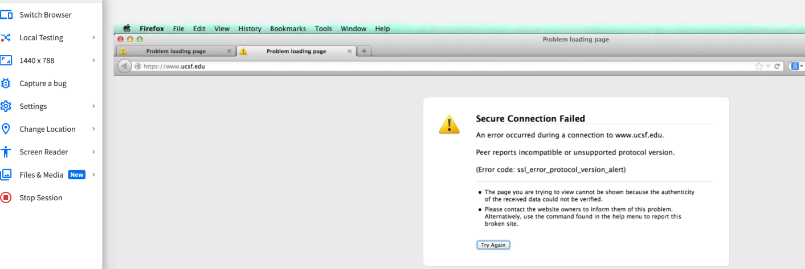
1. Given what you've observed, how should we discuss what browsers a site supports?
- **Testing UCSF.edu on Firefox v25 resulted in a "Secure Connection Failed" error, likely due to the site requiring modern SSL/TLS protocols (e.g., TLS 1.2 or 1.3), which the outdated browser does not support.**

### Discussion regarding browser support:
- **The target audience, the goal of the website, and the testing resources are all important factors to take into account when talking about browser support. To guarantee optimum speed, security, and accessibility, a website should preferably support the most recent versions of the main browsers (e.g., Chrome, Firefox, Safari, Edge). However, depending on user demographics or particular needs, backward compatibility with outdated browsers could be required. To guarantee a consistent user experience across platforms in such situations, extensive testing on a range of browsers and devices is essential.**

## Question 13. UCSF.edu 

Now visit ucsf.eduLinks to an external site. in your local browser and open Chrome DevTools:

1. Note the use of X-Content-Type-Options header in responses. What is this header specifying?
- The UCSF website uses the `X-Content-Type-Options` header with the value `nosniff` to enhance security by preventing MIME-type sniffing. This ensures the browser strictly follows the declared `Content-Type`, reducing the risk of MIME-type confusion attacks, where misidentified files could be executed maliciously.

2. It appears something called Cloudflare is being used by this site. Define what Cloudflare is and what it is used for
- A online infrastructure and security platform called Cloudflare improves the dependability, security, and performance of websites. With capabilities like caching, encryption, and traffic filtering, it serves as a reverse proxy and content delivery network (CDN), accelerating the delivery of material, thwarting DDoS assaults, and guaranteeing dependable, secure connections.

## Question 14. Cookies

Visit ucsd.edu and open Chrome DevTools:

(NOTE! Make sure your ad blocker is disabled for this question, there are definitely cookies on both pages)

1. How many Cookies are there for UCSD homepage? **42**
2. How many different domains are shown for the cookies on UCSD? 
   1. https://www.ucsd.edu
   2. https://www.google.com
   3. https://www.youtube.com
   4. https://accounts.google.com
   5. https://doubleclick.net
3. How many Cookies are there for SDSU homepage? **36**
4. How many different domains are shown for the cookies on SDSU?
   1. https://www.sdsu.edu
   2. https://dt.doubleclick.net
   3. https://8a57e258-cf07
   4. https://www.google.com
   5. https://www.youtube.com
